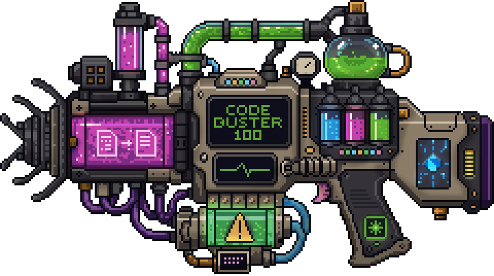

<h1>
<p align="center">
  
  <br>Code Buster
</h1>
  <p align="center">
    The AI Improver for code
    <br />
    <br />
    <a href="https://toolbunker.dev/code-buster/">Overview</a>
    ·
    <a href="https://toolbunker.dev/code-buster/docs/getting-started/installation">Installation</a>
    ·
    <a href="https://toolbunker.dev/code-buster/docs/">Documentation</a>
    ·
    <a href="CONTRIBUTING.md">Contributing</a>
  </p>
</p>

## Find what your AI agent missed

Code Buster is a deterministic, offline repository-analysis CLI. It examines
individual files and relationships across a repository, then reports potential
issues for you or your AI agent to evaluate and fix.

It does not upload source code, call an AI provider, or make semantic changes on
its own. The executable is `cb`; optional repository configuration lives in
`code-buster.toml`.

- 18 recognized source languages
- 450 registered rules
- 7 report formats
- 0 required cloud services

## Quickstart

Install the native Apple Silicon macOS build with Homebrew:

```sh
brew install tool-bunker/tap/code-buster
cb version
```

Install a native Apple Silicon macOS or x86-64 Linux build with the verified
installer:

```sh
curl -fsSL https://codebuster.toolbunker.dev/install | sh
```

On x86-64 Windows PowerShell:

```powershell
irm https://codebuster.toolbunker.dev/install.ps1 | iex
```

When Dart 3.11 or newer is already installed:

```sh
dart pub global activate code_buster
cb version
```

Then run Code Buster from a repository root:

```sh
cb summary
```

Configuration is optional. Start with coverage in the summary, then use focused
commands such as `review`, `duplication`, `graph`, `dead`, `hotspots`, or
`inspect` for the question you need to answer.

See the [installation guide](https://toolbunker.dev/code-buster/docs/getting-started/installation)
and [quickstart](https://toolbunker.dev/code-buster/docs/getting-started/quickstart)
for every supported path.

## What Code Buster finds

Code Buster combines file-level rules with repository-wide analysis. It reports:

- dependency cycles and architecture-policy violations;
- duplicated blocks, near-duplicate functions, and repeated patterns;
- unreachable production files and declarations;
- complexity growth, hotspots, and maintainability risks;
- correctness, reliability, security, accessibility, performance, and style findings;
- repository structure, source classification, framework, and design-system drift.

Findings can include a stable rule ID, severity, confidence, location,
rationale, remediation guidance, related files, and fingerprint. A finding is
evidence for review, not proof that the code is wrong.

## Use it with an AI coding agent

Code Buster can give an agent focused repository evidence without placing the
whole codebase in the model's context:

```sh
cb review --format json
```

Pass relevant findings to the agent, ask it to evaluate each one against the
intended behavior, review the proposed change, then run the project's own tests
and exercise the changed path. Code Buster finds issues; the developer or agent
decides what matters and makes the fix.

## Language and framework support

Code Buster recognizes C and C++, Objective-C, C#, Dart, Rust, Mojo, Odin, Nim,
Python, JavaScript, TypeScript, Go, HTML, CSS, Java, Wren, SQL, and Lua/Luau.
Analysis depth and real-world validation vary by language. Flutter and React are
detected as framework profiles rather than separate source languages.

See the current [language support matrix](https://toolbunker.dev/code-buster/docs/reference/languages).

## Reports and integrations

Available formats are text, JSON, NDJSON, Markdown, SARIF 2.1.0, Mermaid, and
JUnit XML. The repository also includes starting integrations for GitHub Actions,
Gradle, Maven, VS Code, and Code Climate conversion.

See the [command reference](https://toolbunker.dev/code-buster/docs/reference/commands),
[report reference](https://toolbunker.dev/code-buster/docs/reference/reports), and
[integration guide](https://toolbunker.dev/code-buster/docs/guides/integrations).

## Current status

Current release: **0.7.1**.

Code Buster is pre-1.0 and under active development. Use it for local repository
exploration, focused AI context, and reviewing changes before handoff. Do not yet
rely on it as a blocking production quality gate; evaluate CI and report
integrations with explicit policy and preserved coverage.

## Development and contributing

Build the canonical Dart implementation from source:

```sh
dart pub get
dart compile exe bin/cb.dart -o build/cb
./build/cb version
```

Open pull requests against `develop`. The `main` branch is reserved for reviewed
release changes and coordinated hotfixes. Read [CONTRIBUTING.md](CONTRIBUTING.md)
for the complete contribution and verification contract.
